# KaseiCoin Crowdsale


This project creates a fungible token that is ERC-20 compliant and that will be minted by using a crowdsale contract from the OpenZeppelin Solidity library. The idea is to develop a monetary system for the first human colony on Mars. The new monetary system is based on blockchain technology and defines a new cryptocurrency named KaseiCoin. The crowdsale contract manages the entire crowdsale process, allowing users to send ether to the contract and in return receive KAI, or KaseiCoin tokens. The contract mints the tokens automatically and distributes them to buyers in one transaction. 

---

## Technologies
This project leverages the following tools:
* [Solidity](https://docs.soliditylang.org/en/v0.8.13/) - programming language for implementing smart contracts
* [Remix IDE](https://remix.ethereum.org/#optimize=false&runs=200&evmVersion=null&version=soljson-v0.8.7+commit.e28d00a7.js) - open source tool that helps you write Solidity contracts straight from the browser; has modules for testing, debugging, and deploying of smart contracts
* [Ganache](https://trufflesuite.com/ganache/) - A program that allows you to quickly set up a local blockchain, which you can use to test and develop smart contracts
* [MetaMask](https://metamask.io/) - allows users to store and manage account keys, broadcast transactions, send and receive Ethereum-based cryptocurrencies and tokens, and securely connect to decentralized applications through a compatible web browser or the mobile app's built-in browser

The Solidity version used for this project was the following:
`pragma solidity ^0.5.5`

OpenZeppelin libraries that were imported in Remix:

```
ERC20 Token:
import "https://github.com/OpenZeppelin/openzeppelin-contracts/blob/release-v2.5.0/contracts/token/ERC20/ERC20.sol";
import "https://github.com/OpenZeppelin/openzeppelin-contracts/blob/release-v2.5.0/contracts/token/ERC20/ERC20Detailed.sol";
import "https://github.com/OpenZeppelin/openzeppelin-contracts/blob/release-v2.5.0/contracts/token/ERC20/ERC20Mintable.sol";

Crowdsale:
import "https://github.com/OpenZeppelin/openzeppelin-contracts/blob/release-v2.5.0/contracts/crowdsale/Crowdsale.sol";
import "https://github.com/OpenZeppelin/openzeppelin-contracts/blob/release-v2.5.0/contracts/crowdsale/emission/MintedCrowdsale.sol";
```

---

## Installation Guide
If you do not already have these tools installed, install them now: 
1. Download and install the MetaMask browser extension. Follow the [instructions here](https://metamask.io/download/) to install it.
2. Download and install the lastest version of Ganache. Follow the [instructions here](https://trufflesuite.com/ganache/) to install it. To create a workspace, click on "Quickstart Ethereum".

---

## Usage and Setup
1. Open [Remix IDE](https://remix.ethereum.org/#optimize=false&runs=200&evmVersion=null&version=soljson-v0.8.7+commit.e28d00a7.js) 

2. Open the smart contract files (`KaseiCoin.sol`, `KaseiCoinCrowdsale.sol`) in Remix IDE. (You may need to create new files and copy and paste the Solidity code to the files)

3. While in the `KaseiCoin.sol` file, select the "Solidity Compiler" tab and press the button that says, "Compile KaseiCoin.sol"

4. While in the `KaseiCoinCrowdsale.sol` file, select the "Solidity Compiler" tab and press the button that says, "Compile KaseiCoinCrowdsale.sol"
Example: 

5. Open **Ganache** and **Metamask**

6. Copy the Ganache RPC Server: HTTP://127.0.0.1:7545

7. Create and save a new network in MetaMask as shown below:
  

8. Open MetaMask and choose **Import Account**:
Example: 

9. Go to Ganache and copy a private key for the account:

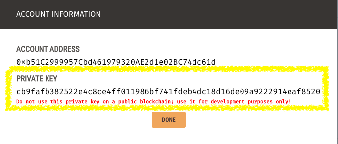

10. Go to MetaMask to paste the private key and import/create the account:


11. There should be 100 ETH in the account, and the last 4 digits of the account in MetaMask should correspond to the last 4 digits of the account address in Ganache

12. Repeat steps 8-11 to create one more account so that you now have 2 accounts in MetaMask connected with two different addresses in Ganache

13. Select the "Deploy and Run Transactions" tab and choose the environment of **Injected Web3**. This should open MetaMask.


14. Verify the connection to MetaMask and select the accounts that you want to be linked to the Remix contract


15. Deploy the crowdsale contract - see further details and explanation below in the "Evaluation Evidence" section
---

## Methods
1. Create the KaseiCoin Token Contract
2. Create the KaseiCoin Crowdsale Contract
3. Create the KaseiCoin Deployer Contract
4. Deploy the Crowdsale to a local blockchain by using Remix, MetaMask, and Ganache

---

## Evaluation Evidence
Here are examples of the KaseiCoin crowdsale in action:

### Deployed Contract
Deploy the `KaseiCoinCrowdsaleDeployer` contract from the `KaseiCoinCrowdsale.sol` file:
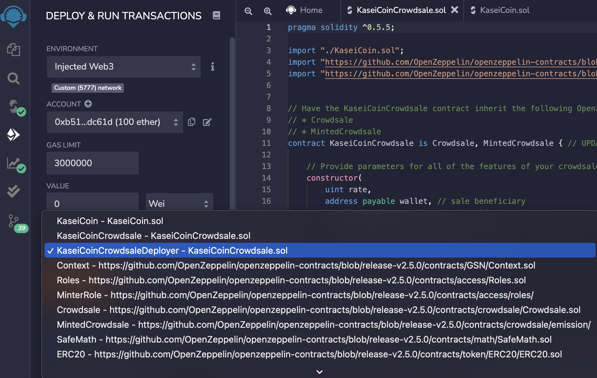

Fill in the 3 required boxes for the DEPLOY function and press **transact**:
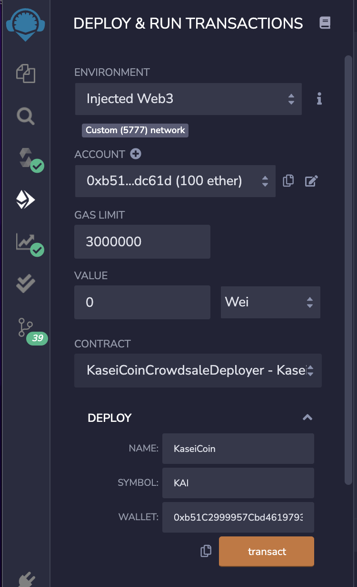

Confirm the deployment in MetaMask:
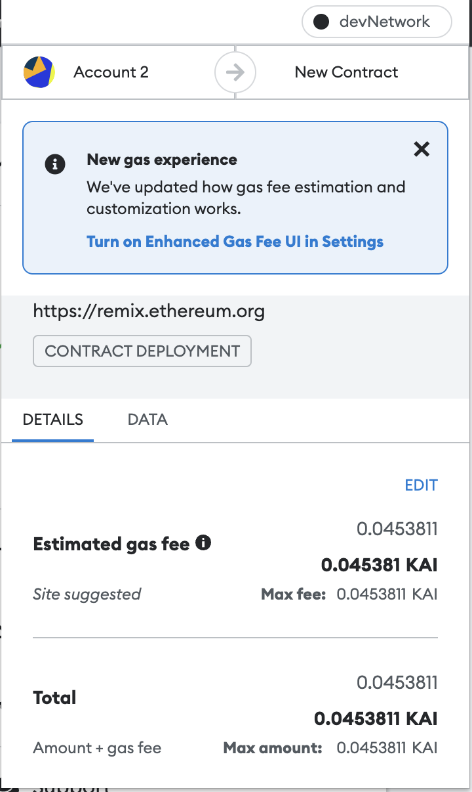

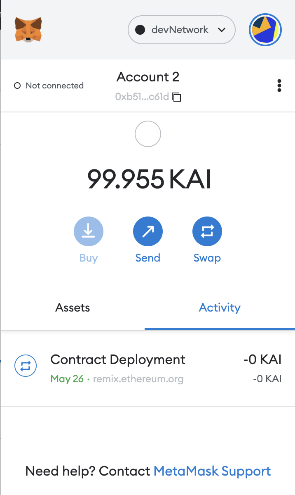

Confirm the deployment in Ganache:
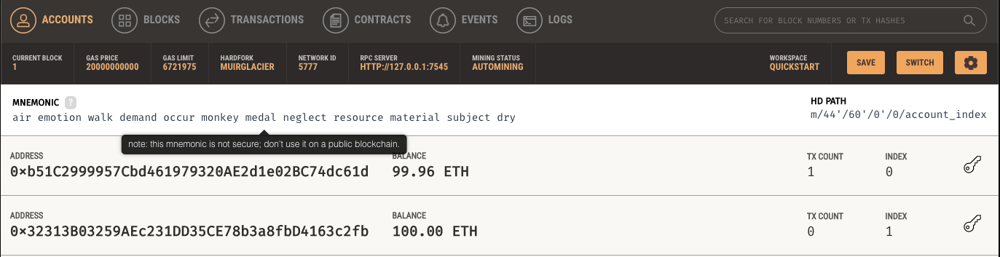

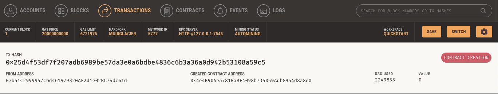

### Link the Contract Addresses to the Remix Smart Contract

Copy the `kasei_crowdsale_address`. Change the contract to `KaseiCoinCrowdsale`. Paste the address into the box next to "At Address". Click the button "At Address". This tells Remix where the contract is located:
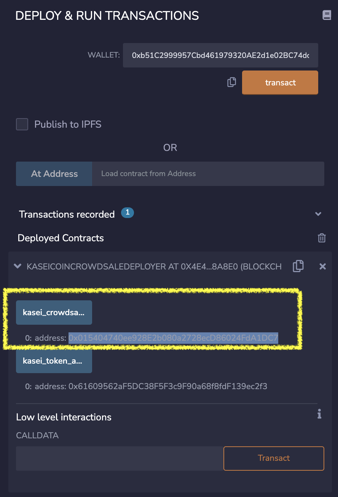

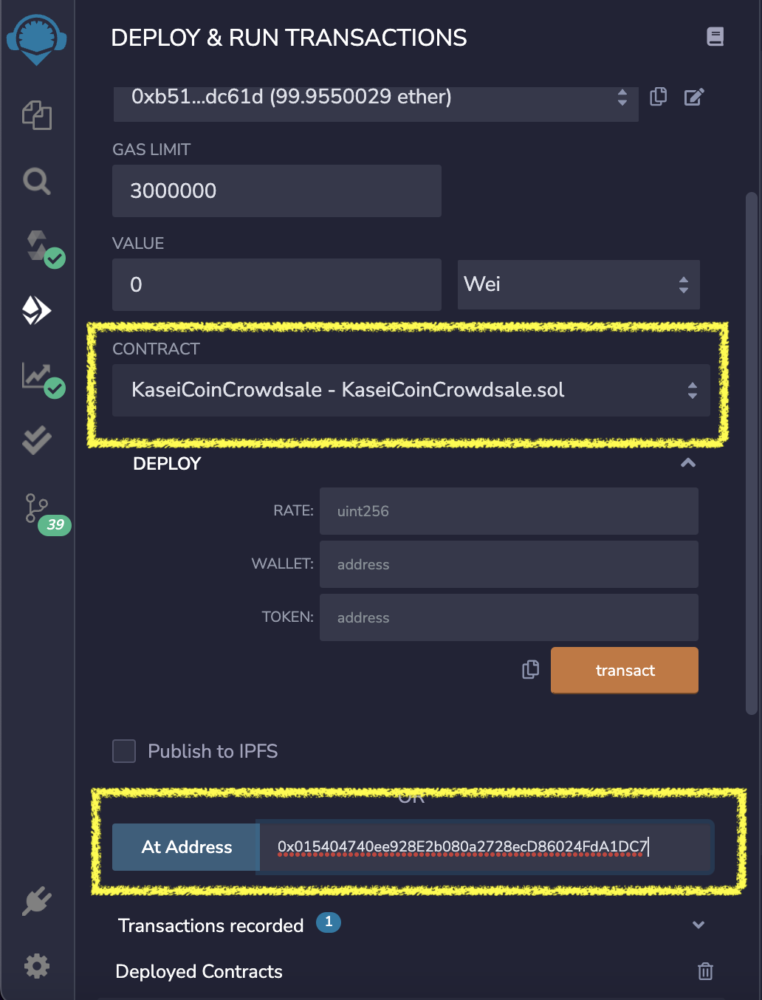

The KaseiCoinCrowdsale contract functions appear in the deployment pane:
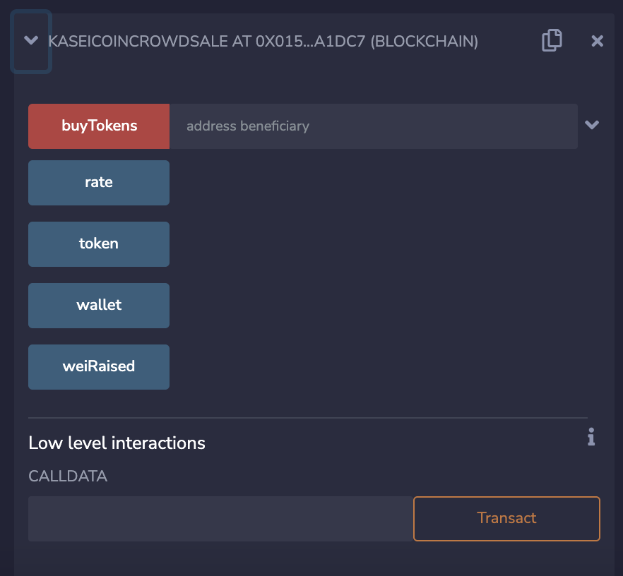

Now, copy the `kasei_token_address`. Change the contract to `KaseiCoin`. Paste the address into the box next to "At Address". Click the button "At Address" to link the contract.
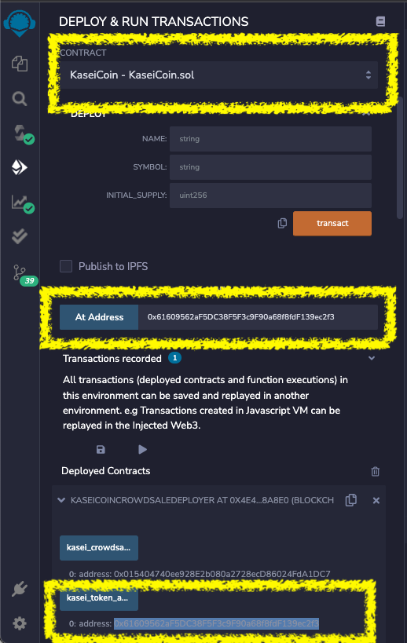

The KaseiCoin contract functions appear in the deployment pane:
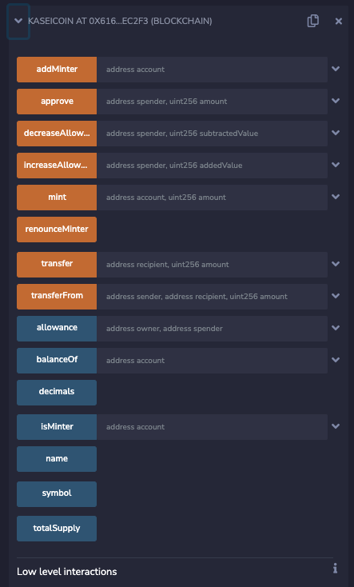

### Interact with the Contracts

1. Specify the address that is buying the tokens by using the `KaseiCoinCrowdsale` contract "buyToken" function. *(I used the address in Account 3 of MetaMask and the second address from Ganache - 0x323)*
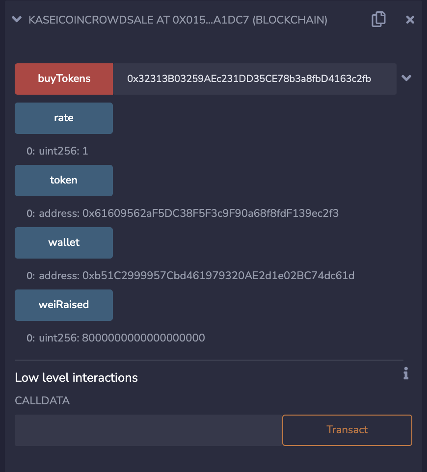

2. Input the value in Ether to buy the corresponding amount of tokens.
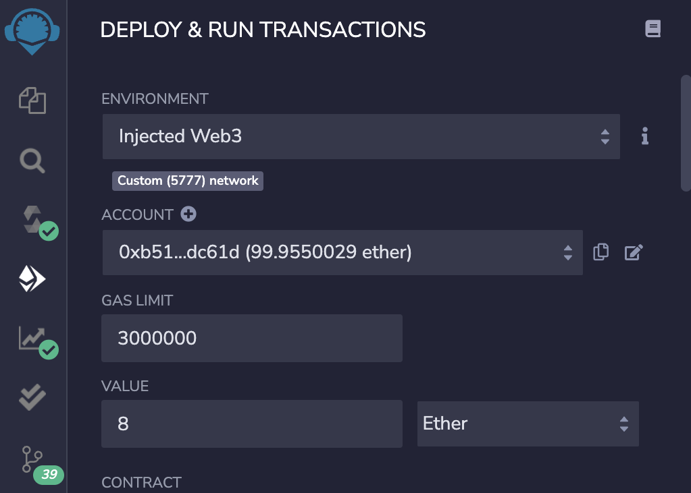

**IMPORTANT NOTE: My Ganache got disconnected, so I had to go through the process again and add new account addresses. I will point out which address from the screenshots above that it would correspond to. The new example can be found in entirety in the videos I uploaded to the "Video" folder.**

3. Click on the "buyTokens" button and MetaMask will open showing the transaction. Click "confirm" to confirm the transaction. (In this new example, the new address bought 9 Ether)
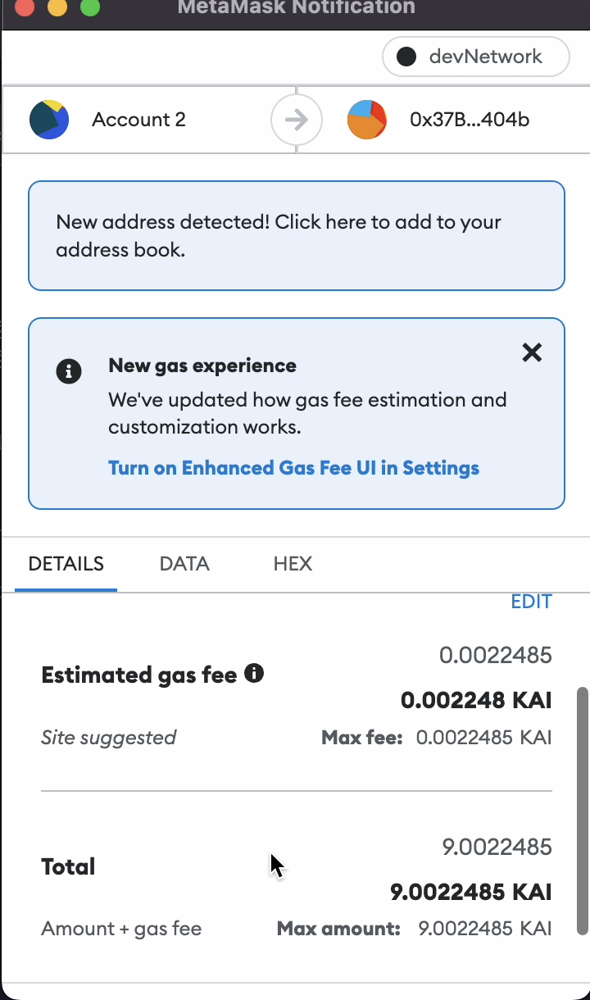

4. Click on the "balanceOf" button to check the current balance of the address that bought the tokens *(Example from earlier would be the 0x323 address. Current example is the 0x163 address)*.

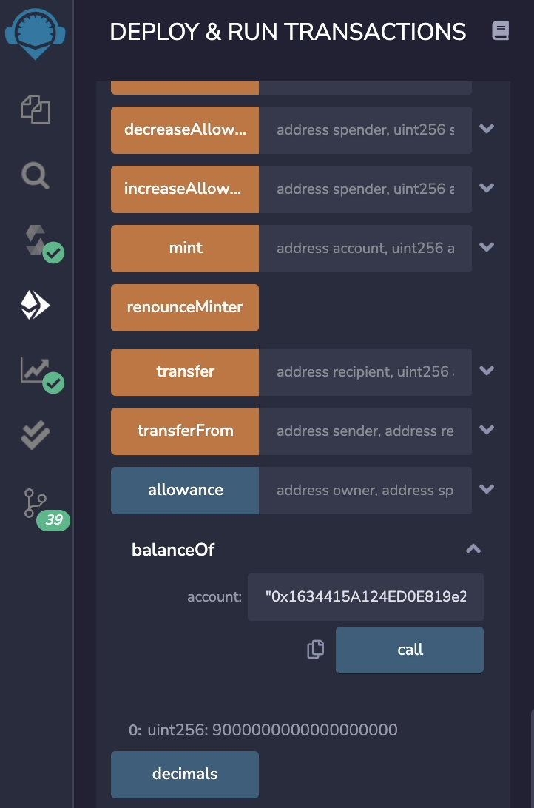

5. Select the buttons from the `KaseiCoinCrowdsale` Contract:
-Click on the "rate" button to check how many tokens you get per Ether. 
-Click on the "token" button to verify the address of the token 
-Click on the "wallet" button to see the account address where all of the ether raised in the crowdsale will go 
-Click on the "weiRaised" button to see the amount of wei that has been raised so far in the crowdsale.

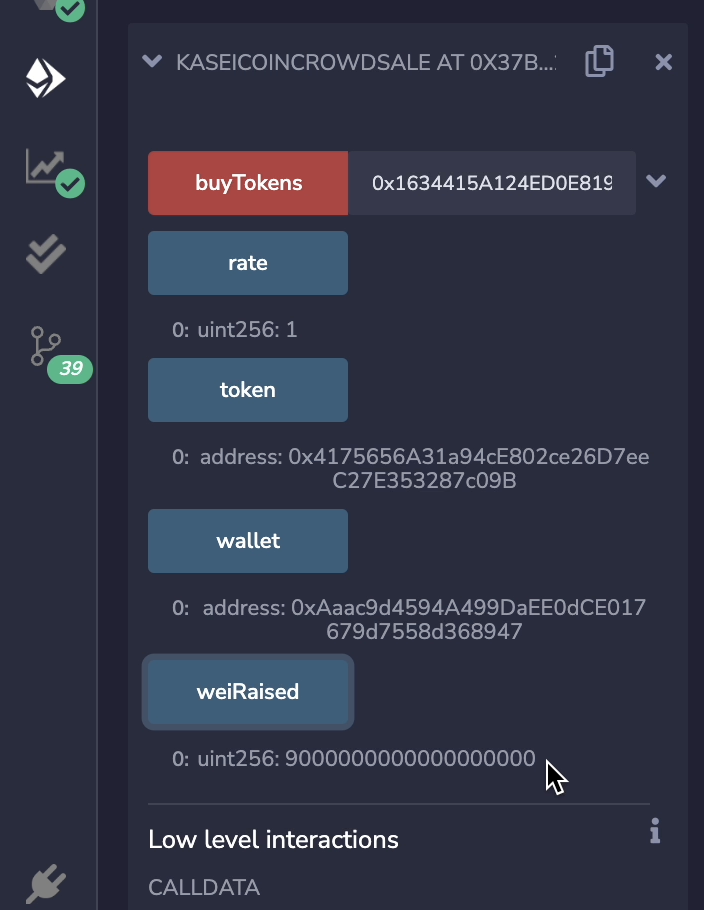

---

## Contributors
Catherine Croft

Email: catherinecroft1014@gmail.com

LinkedIn: [catherine-croft](https://www.linkedin.com/in/catherine-croft-4715481aa/)

---

## License 
MIT